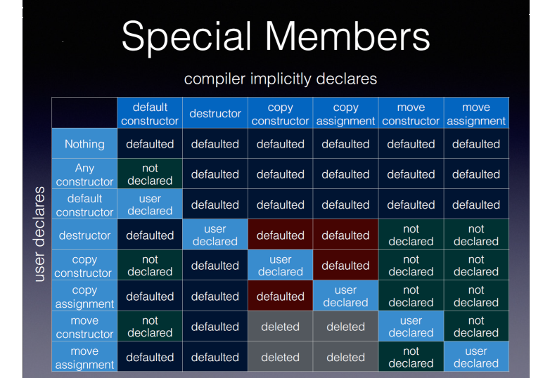

 # Are the Old Ways Sometimes the Best (Part 2)?

_Comparing the 'classic C++' and 'modern' ways to solve various programming tasks_

## Introduction

This article is based on the second part of my ACCU 2023 presentation of the same name.

In the first part I looked at some of the many different ways a simple <code>for</code> loop from 'vintage' C++98 could be re-written using various facilities of the releases of C++ over the last 25 years.

In this part I examine a number of other C++ examples where such re-writes are also possible.

The code is deliberately kept minimal so the examples are clearer; in an actual code base they would typically span more lines.

**Table of Contents**
- [Streaming messages to/from memory](#streaming)
- [Initializing objects](#initializing)
- [The rule(s) of 'N'](#rule-of-n)
- [Ways to initialize](#ways-to-initialize)
- [Conclusion](#conclusion)

<a id="streaming"></a>
## Streaming messages to/from memory

The C++ "hello world" program used for years as the first program in C++ for beginners demonstrates the <i>streaming </i>idiom:
```cpp
#include <iostream>
int main() {
  std::cout << "Hello world" << std::endl;
}
```
However, the streaming paradigm is not just applicable for writing (or reading) directly to the console like this, it is also usable in a number of different contexts. Possible examples include:
- Logging (often hidden inside a macro)
- Parsing input strings obtained elsewhere
- Streaming messages to/from memory

### Logging

We often want to log information about values during the execution of a program and the streaming paradigm gives us a well recognised way to do so. The "customization point" for adding support for this to user-defined types is well known - simply provide an overload for <code>operator<<()</code> with a second argument of the new type.

Logging is often buried inside a macro, for various reasons beyond the scope of this article, but expands to, for example, an eventual call to:

`extern "C" void log(const char *str);`

via creating a string in memory using the streaming operator:

```cpp
  oss << "Input " << 42 << " produced " << result
      << " at line " << __LINE__;
  log(oss.str());
```

### Streaming messages to/from memory

Back in the old days pre-C++98 we used <code>&lt;strstream></code> (or probably <code>&lt;strstream.h></code>) so our logging call might expand like this:
```cpp
#include <strstream>
...
   std::ostrstream oss;
   oss << "Input " << 42 << " produced " << result
       << " at line " << __LINE__;
  log(oss.str());
...
```

Conversely, you can use <i>input </i>streams to, for instance, extract fields from a string; here is how you might have does this pre-C++98:
```cpp
#include <strstream>

void area::configure(const std::string& value) {
  std::istrstream iss(value.c_str());
  if (!(iss >> width >> height)) {
    throw std::runtime_error("Error in '" + value + "'");
  }
  ...
}
```

### Here be dragons

However, there were some pitfalls with using <code>&lt;strstream></code> which could cause hard to diagnose behaviour: the example logging code shown above demonstrates two of these.

Firstly, the code shown does not guarantee that the string produced will be zero terminated. In order to ensure this you have to remember to add <code>std::ends</code> into the output stream as the last item. Unfortunately such bugs could remain latent for some time, as it often happened that the next byte after the end of the charcters written was a zero so the code might work in many cases.

Secondly the code leaks memory unless you call <code>oss.freeze(false)</code>. This was done by design when <code>oss.str()</code> was called, as this returns a pointer to the internal buffer and it was all too easy to retain the pointer after the underlying stream had ended.

So, here is a corrected version of the code above fixing those two issues:
```cpp
#include <strstream>
...
  std::ostrstream oss;
  oss << "Input " << 42 << " produced " << result
      << " at line " << __LINE__ << std::ends;
  log(oss.str());
  oss.freeze(false);
...
```

The percipient will immediately think "RAII" -- we have fixed the 'good' case but would still leak were the <code>log()</code> call to throw an exception. We can do better than this in C++.

### The &lt;sstream> header

Given the problems with using <code>strstream</code>, the very first C++ standard included the <code>&lt;strstream></code> header as described, but marked as **deprecated**. The older approach was superceded in C++98 with the <code>&lt;sstream></code> header:
```cpp
#include <sstream>
...
  std::ostringstream oss;
  oss << "Input " << 42 << " produced " << result
      << " at line " << __LINE__;
  log(oss.str().c_str());
...
```
This code is similar to the first, buggy, output example above but the design of <code>ostringstream</code> means that a terminating NUL character is guaranteed, and there is also no memory leak, with or without exceptions.

A similar replacement can be done for the parsing side, too:
```cpp
#include <sstream>

void area::configure(const std::string& value) {
  std::istringstream iss(value); // ctor takes std::string
  if (!(iss >> width >> height)) {
    throw std::runtime_error("Error in '" + value + "'");
  }
  ...
}
```

Unfortunately, while the design for the new facility did resolve some of the "sharp edges" of the old and was also easier to use with standard strings, there were a couple of problems introduced by the new design. It was hard to avoid **copying** the contents of the string and the potential performance issues with this meant that a lot of programmers were reluctant to use them. sometimes with good reason.

For example, in our output example, in the line:
```cpp
  log(oss.str().c_str());
```
the call to <code>oss.str()</code> creates a **new** string object, with a **copy** of the contents of the string stream.

### Move semantics to the rescue

C++11 added rvalue references to the language, and so this copy can be suppressed by making use of move semantics: and this was added in C++20 by Peter Sommerlad's P0408R7 ("Efficient Access to basic_stringbuf's Buffer"). When invoking <code>str()</code> on an **rvalue** reference the internal string itself is returned, rather than a fresh copy. We can modify our output example so it makes use of this to avoid the copy:

```cpp
std::ostringstream oss;
  oss << "Input " << 42 << " produced " << result
      << " at line " << __LINE__;
  log(std::move(oss).str().c_str()); // message payload moved
 ... 
```
### So, is everyone happy now?

Alas, not yet. While this change does help those who were using the internally managed string buffer, the old strstream classes <i>also</i> supported use of an external buffer. For example, you could use <code>ostrstream</code> to write to a local char array using code like this:

```cpp
...
  char fixed_buffer[40];
  std::ostrstream oss(fixed_buffer, sizeof(fixed_buffer));
  oss << "Input " << 42 << " produced " << result
      << " at line " << __LINE__ << std::ends;
  log(oss.str());
...
```
What happens here is that <code>oss</code> writes to the external buffer, not an internally owned one, and <code>oss.str()</code> returns a pointer to this <code>fixed_buffer</code>. The performance advantages of this mechanism are that the data is written to the target directly, and no memory allocation is performed.

Unfortunately, when niavely trying to migrate code away from using <code>ostrstring</code>, passing the same arguments to <code>std::ostringstream</code> may compile -- but does something completely different!
```cpp
  std::ostringstream oss(fixed_buffer, sizeof(fixed_buffer)); // WRONG!
```
First of all, the closest match is to the <code>ostringstream</code> constructor taking first argument of <code>std::string</code> and second of <code>std::ios_base::open_mode</code>. The string argument can be constructed implicitly from <code>fixed_buffer</code> and the second argument <i>may</i> convert from <code>std::size_t</code> to <code>std::ios_base::openmode</code>, depending on how this is defined.

The C++ standard simply says that openmode is a "bitmask type", which is specified as: "Each bitmask type
can be implemented as an enumerated type that overloads certain operators, as an integer type, or as a
bitset."

So what happens on some common implementations?

1. With MSVC the code compiles without warning, as openmode is simply an <code>int</code>.
2. With gcc the code compiles if <code>-fpermissive</code> is provided, with a warning "<code>invalid conversion from 'long unsigned int' to 'std::ios_base::openmode</code>'"
3. With clang it depends on the <code>-stdlib</code> setting: libc++ compiles without warning and libstdc++ behaves, as you'd expect, like gcc.

To my mind this is an unfortunate design, and demonstrates one of the things to consider when designing constructors - how could this be used <i>incorrectly</i> - and is there a way to avoid this?

Additionally, even when it is <i>syntactically </i>correct, it has very different meaning from the <code>ostrstream</code> case: it creates an <code>ostringstream</code> with initial contents provided by the (null-terminated) string at <code>fixed_buffer</code>, and an <code>openmode</code> set to whatever flags sizeof(fixed_buffer) maps to (this is implementation defined).

In fact, this is a foolish quest -- <code>ostringstream</code> does not support equivalent functionality.

Fortunately there **is** now a way to achieve the desired behaviour in modern C++23. P0448R4 (" A strstream replacement using span<charT> as buffer") - also by Peter Sommerlad) adds **span streams** to C++23. These take an <code>std::span</code>, which can be implicitly created from the buffer and length, and use the contents of this span as the buffer. The <code>span()</code> method returns a span that covers the area so far written to.

Using this with a log function taking a null-terminated string could be done like this:
```cpp
#include <spanstream>
...
  char fixed_buffer[40];
  std::ospanstream oss({fixed_buffer, sizeof(fixed_buffer)});
  oss << "Input " << 42 << " produced " << result
      << " at line " << __LINE__ << std::ends;
  log(oss.span().data());
 ... 
```
If you have a C++ interface that takes a <code>std::string_view</code> (or a pointer and a length), then you can use it directly, and you no longer need to add the <code>std::ends</code> to get null termination:
```cpp
#include <spanstream>
...
  char fixed_buffer[40];
  std::ospanstream oss(fixed_buffer, sizeof(fixed_buffer));
  oss << "Input " << 42 << " produced " << result
      << " at line " << __LINE__;
  log(oss.span());
```

At this point I believe the output side of <code>ostrstream</code> has been replaced successfully and so there should no longer be a need to use it for code compiled with C++23.

### What about input?

There is also an input span view, which like with the old <code>istrstream</code>, avoids needing a string at all:
```cpp
#include <spanstream>
...
  void configure(const std::string& value) {
  std::ispanstream iss(value);
  if (!(iss >> width >> height)) {
    throw std::runtime_error("Error in '" + value + "'");
  }
  ...
}
```
### Reflection

I think that <code>&lt;strstream></code> is a salutary example of an unexpectedly long lived class. While <code>&lt;sstream></code> is a cleaner design without many of the pitfalls of <code>&lt;strstream></code> the extra encapsulation reduced the take-up of the new header. This is something for all of us to consider when trying to provide an upgrade path: what might <i>prevent</i> someone upgrading. In particular, given the history and usages of C++, performance must be a consideration.

#### Note

In my original presentation of this material at the ACCU Conference I pointed out that Peter's paper states: "It also proposes to remove the deprecated strstreams [depr.str.strstreams] assuming p0407 is also included in the standard." However, this was not part of the formal wording adopted into C++23 as the library working group wanted to ensure migration would be straightforward: a user wanting to replace exsting code using <code>istrstring</code> with <code>ispanstream</code> can <i>first</i> upgrade their compiler to C++23, still using the deprecated header, and <i>then</i> replace it. I suggested that the header could be deleted post C++23.

Since the conference Alisdair Meredith, as I had hoped, has picked up on this and produced a paper, P2867R1 ("Remove Deprecated strstreams From C++26") so we can hope that C++26 will finally remove the pre-C++98 facility. Thank you, Alisdair and Peter.

<a id="initializing"></a>
## Initializing objects

One of the important concepts in C++ is that of the constructor: ensuring that objects are correctly initialized.
For example, let's consider this simplified class:
```cpp
class point {
  int x, y;
  double distance;
public:
  point(int x, int y);
  point(const std::pair<int, int>& coord);
  // accessors, etc\'85
};
```
One way to write the constructors could be, for instance:
```cpp
point::point(int x, int y) : 
  x(x),
  y(y),
  distance(std::sqrt(x*x + y*y)) {}

point::point(const std::pair<int, int>& coord) :
  x(coord.first),
  y(coord.second),
  distance(std::sqrt(x*x + y*y)) {}
```
There is some near duplication here - can we avoid it? The DRY principle ("Don't Repeat Yourself") encourages removal of duplication where possible.

(There is also some subtlety going on in this example - while the two constructors both appear to contain the same expression, <code> distance(std::sqrt(x*x + y*y))</code>, they are in fact different expressions. In the first case, <code>x</code> and <code>y</code> are the names of the <i>parameters</i> t othe constructor, whereas in the second example they are the names of the <i>member data</i> of point.)

### Using a helper member function

Since C++98 one way is to use a helper member function:
```cpp
point::point(int x, int y) : 
  x(x),
  y(y) {
  init();
}

point::point(const std::pair<int, int>& coord) :
  x(coord.first),
  y(coord.second) {
  init();
}

void point::init() {
  distance = std::sqrt(x*x + y*y);
}
```
This mechanism factors some of the duplication into a single, probably private, place. It also means the <i>same</i> expression is now being used to initialise <code>distance</code>. However, this technique doesn't work in all cases and since C++98 we have other tools we can use.

### Forwarding constructors

C++11 brought us the ability for one constructor to invoke another. (This is often used to forward several constructors that default various arguments on to a common constructor that takes a full set of arguments.) In this case we could leave the first constructor unchanged and forward to it from the second:
```cpp
point::point(int x, int y) : 
  x(x),
  y(y),
  distance(std::sqrt(x*x + y*y)) {}

point::point(const std::pair<int, int>& coord) :
  point(coord.first, coord.second) {}
```

The code is shorter and, I believe, expresses the intent more clearly. It is also more resilient in the face of future changes, such as the classic case of adding a field which is _accidentally_ not initialized in one of the several constructors.

There may be a performance impact, esp. in unoptimised builds. As always, measure (or inspect the compiler output) to see whether there is any material impact.

### Non-static data member initialisers

C++11 also brought us non-static data member initializers (with the snappy acronym of NSDMI) which </code>also allow us to express the construction constraint in this example:
```cpp
class point {
  int x, y;
  double distance = std::sqrt(x*x + y*y);
  // etc
```
And in the implementation file we no longer need to mention <code>distance</code>:
```cpp
point::point(int x, int y) : 
  x(x),
  y(y)
 {}

point::point(const std::pair<int, int>& coord) :
  x(coord.first),
  y(coord.second)
{}
```
However, this is may have other consequences. Note here that the header file must now <code>#include <cmath></code>. Or of course you could provide a private static helper method, to avoid needing the extra include in the header:
```cpp
class point {
  int x, y;
  double distance = calculate(x, y);
  static double calculate(int x, int y);
  // etc
```
And in the implementation file:
```cpp
double point::calculate(int x, int y) {
  return distance(sqrt(x*x + y*y));
}
```
All of these techiques improve on the original code that provided separate multiple constructors. The main downside is that there may be a slightly higher congitive overhead for each constructor individually.

In order to understand what one of the constructors does in the <i>original </i>code you read it on its own.
- When using a helper function you also need to understand what this function does
- When using forwarding constructors you also need to look at the target constructor
- When using NSDMIs you also need to look at the definitions of the fields in the class.

However, since these techniques reduce duplication in the class as a whole the overall effect should be to <i>reduce</i> complication; and also make the class easier to change safely.

<a id="rule-of-n"></a>
## The rule(s) of 'N'

When designing a class, the decisions about providing constructors, destructors, and asignment operators are related. From the early days of C++ we have had the "rule of three", coined by Marshal Cline in 1991:
"if a class defines any of the following then it should probably explicitly define all three:
- destructor
- copy constructor
- copy assignment operator"

So we had N=3 in "the rule of 'N'" for many years.

A standard example of the rule of three, for an owned buffer:
```cpp
class packet {
  std::size_t len_;
  char *buffer_; // owned by the instance of the class
  // ...
public:
  // various constructors...

  ~packet();
  packet(const packet &rhs);
  packet& operator=(const packet &rhs);

  // other methods ... 
};
```

And a possible implementation of the three special member functions:
```cpp
packet::~packet() {
  delete[] buffer_;
}
packet::packet(const packet &rhs)
  : len_(rhs.len_), buffer_(new char [len_])
{
  memcpy(buffer_, rhs.buffer_, len_);
}
packet::packet& operator=(const packet &rhs) {
  packet{rhs}.swap(*this);
  return *this;
}
```
When designing a class, the decisions about providing constructors, destructors, and asignment operators are related. Of course, in C++11 we added <i>move semantics</i> to the language. So there's now a move constructor and a move assignment operator to consider as well.

### What if we stick with the rule of three?

If we **don't** declare the two extra members then they're not declared for us. Attempting to move objects of the class for construction or assignment simply calls the copy operation. Howard Hinnant produced a good table of the interaction between the various special member functions, which he presented in the closing keynote at the 2014 ACCU conference



If members of your class are more expensive to copy than to move then you are likely to want to add the move operations to achieve better performance.

### So we're going need a bigger boat

Now we have N = 5....

The naive rule of five is: "if a type ever needs one of the following, then it must have all five:
- destructor
- copy constructor
- move constructor
- copy assignment operator
- move assignment operator"

How to implement these two additional special member function depends on what we choose for the semantics of the moved-from state.

Here is one way to convert the code to use the rule of five, highlighting the additions:
```cpp
class packet {
  char *buffer; // owned by the instance of the class
  // ...
public:
  ~packet();
  packet(const packet &rhs);
  packet(packet &&rhs) noexcept;
  packet& operator=(const packet &rhs);
  packet& operator=(packet &&rhs) noexcept;
  // ... 
};
```
(you usually want the newly added move methods to be noexcept.)

One possible implementation of the two member functions added by the rule of five:
```cpp
packet::packet(packet &&rhs) noexcept
: len_(rhs.len_), buffer_(rhs.buffer_) { rhs.buffer_ = nullptr; )

packet& operator=(packet &&rhs) {
  this->swap(rhs);
  return *this;
}
```
The moved from state should be: "valid but unspecified". We have just introduced behaviour that allows, for the first time, for <code>buffer_</code> to be null. There is a potential time-bomb here if we ever end up, for example, copy constructing from an object moved from by the move constructor above.

We might try to avoid this complication by making the moved from state have a non-null <code>buffer_</code>:
```cpp
packet::packet(packet &&rhs) noexcept
: len_(rhs.len_), buffer_(rhs.buffer_) { rhs.len_ = 0; rhs.buffer_ = new char[0]; )
```
But now we have a problem: if the call to <code>new</code> throws the noexcept means we will terminate, but if we remove the <code>noexcept</code>  then some standard algorithms will now need to use copying</code> rather than moving to ensure they have the right exception guarentee. This is all adding extra complexity into our <code>packet</code> class. 

### Using a separate object to handle the ownership

The single responsibility principle suggests we delegate the buffer management to a separate object.
```cpp
class packet {
  std::vector<char> buffer_; // (or whatever)
  // ...
public:
  // various constructors...

  // various methods...
};
```
Now the sub-object manages the ownership and, in this case, also handles the rule of five for us. We may not need to provide <i>any</i> of the special member functions that are listed in the rule of five (depending what other member data the class actually has), as the compiler generated defaults will create the right behaviour from the special member functions invoked for <code>buffer_</code>.

If we need, for example, a destructor then we can <code>=default</code> the methods we want.
```cpp
class packet {
  std::vector<char> buffer_; // (or whatever)
  // ...
public:
  // various constructors...
  virtual ~packet() = 0;
  packet(const packet &rhs) = default;
  packet(packet &&rhs) = default;
  packet& operator=(const packet &rhs) = default;
  packet& operator=(packet &&rhs) = default;
};
```

The best case is when N = 0 - "the rule of zero". We can, and should, make use of helper objects to avoid the "main" class having responsibility for too many things. These helper objects can use existing classes, or can be instances of classes nested within the class using them.

When moving older code to modern C++ it is an easy trap to simply add the "missing" move operations when you might do better refactoring the code to make the existing copy operations implicit and then letting the compiler generate all of these five special member functions for you.

<a id="ways-to-initialize"></a>
## Ways to initialize

There are many ways in C++ to initialise even a simple **integer** variable:
```cpp
int main() {
  int i = 0;
  int j(0);
  int k{0};

  auto l = 0;
  auto m(0);
  auto n{0};
}
```
What are the differences between these ways? If you see such differences in source code, are they <i>deliberate</i> or simply <i>accidental</i> complexity?

The first method, using "=", is common to most computer languages (although some spell it differently, such as using '<code>:=</code>'). It will be readily understood without confusion by programmers from a wide range of backgrounds.

There are similar options for initializing variables of a **class** type:
```cpp
int main() {
  std::string i = "test";
  std::string j("test");
  std::string k{"test"};

  auto l = std::string{"test"};
  auto m(std::string("test"));
  auto n{std::string{"test"}};
}
```
What are the differences between <i>these</i> ways? Which do you (and your teams members!) find more <i>readable</i>?

### Default values

What happens when you want a <i>default</i> value of scalar type? Possible ways of removing the initializer for a scalar type to produce this could result in:
```cpp
int main() {
  int i;      // Whoops: un-initialised
  int j();    // "most vexing parse"
  int k{};    // fine

  auto l;     // error
  auto m();   // "most vexing parse"
  auto n{};   // error
}
```

The so-called "most vexing parse" is that if a declaration <i>can</i> be a function declaration then that is how it is to be interpreted. So here <code>j</code> is a declaration of a "function returning <code>int</code>" and <code>m</code> is a declaration of a "function with a deduced return type".

One of the advantages of C++11's brace initialization is that this particular vexing parse goes away.

Similarly, what happens when you want a default value of class type?
```cpp
int main() {
  std::string i;           // default value
  std::string j();         // "most vexing parse"
  std::string k{};         // default value

  auto l = std::string{};  // default value
  auto m(std::string());   // "most vexing parse"
  auto n{std::string{}};   // default value
}
```
Note the inconsistency that with a class type <code>i</code> is initialised by the constructor, rather than un-initialised as it was with a scalar.

### Datatype mismatches

Another question is what happens when you provide the **wrong** datatype for the initialiser? The result depends on the implicit conversions available, when the target type is known, and may <i>change</i> the target type in the <code>auto</code> case:
```cpp
int main() {
  int i = 0.0;    // truncates
  int j(0.0);     // truncates
  int k{0.0};     // error: narrowing conversion

  auto l = 0.0;   // l is now a double
  auto m(0.0);    // m ''
  auto n{0.0};    // n ''
}
```

What happens when you provide the wrong data type for a class type will depend on the conversions possible from that type to the target type. For example:
```cpp
int main() {
  std::string i = 'Z';           // error
  std::string j('Z');            // error
  std::string k{'Z'};            // "Z"s

  auto l = std:string{'Z'};      // error
  auto m(std::string('Z'));      // error
  auto n{std::string{'Z'}};      // "Z"s
}
```

The third case in each block may be a little unexpected to some readers - it is because the brace initialization case invokes the initializer_list constructor for <code>std::string</code>, providing a list of one 'Z' character.

### Initialization summary

Sadly initialization in C++ is complicated and we've not had a great track record at making it simpler - while uniform initialization has helped it has not resolved all problems (and in some circles is referred to as "unicorn initialization").

Be aware of the pitfalls.

Be careful about "drive-by" changes in the name of consistency - there are some risks of subtly changing the meaning of an initialization expression during such a refactor.

<a id="conclusion"></a>
## Conclusion

The phrase "There's more than one way to do it" (aka TMTOWTDI) is true in many mature systems. It's good to keep up to date with the new ways to do what we already know how to do. However, there are various tradeoffs to make:

- Readability (for the developers and maintainers of the code)
- Availability of features in all your target environments
- "Invisible" performance costs or benefits
- Differences in runtime overhead
- Effects on optimization of the resulting code

<hr>
Copyright (c) Roger Orr 2024-04-07 (First published in CVu, Nov 2023)
