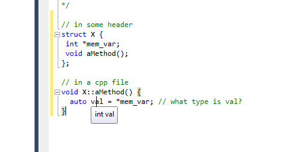
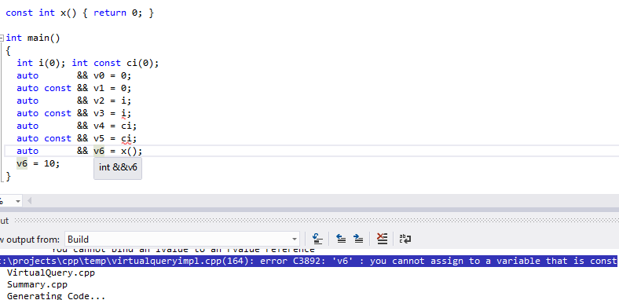

<HTML>
<HEAD>
<link type="text/css" rel="stylesheet" href="../or2.css">
<TITLE>
</TITLE>
</HEAD><BODY style="font-family:arial">
<H1>Auto - a necessary evil? (part 2)</H1>

(<i>This article is based on the presentation of that title at ACCU 2013.</i>)

"To have a right to do a thing is not at all the same as to be right in doing it."  - G.K.Chesterton.

<H2>
Introduction
</H2>

In the first article we covered the rules governing the <code>auto</code> keyword that was added to the
language in C++11 (or added back, if your memory of C++ goes back far enough!)

It is important with a feature like <code>auto</code> not only to know the rules about
what is permitted by the language - and the meaning of the consequent code  - but also to be able
to decide <b>when</b> the use of the feature is appropriate and what design forces need to be considered
when taking such decisions.

In this article we look in more detail at some uses of <code>auto</code> with the intent of identifying
some of these issues.

<H2>
A "Complex type" example
</H2>

One of the main motivations for <code>auto</code> was to simplify the declaration of variables with 'complicated' types.
One such example is in the use of iterators over standard library containers in cases such as:

<pre>
std::vector&lt;std::set&lt;int&gt;&gt; setcoll;
<b>std::vector&lt;std::set&lt;int&gt;&gt;::const_iterator</b> it = setcoll.cbegin();*
</pre>

* <code>cbegin</code> is another C++11 addition: it explicitly returns a <code>const</code> iterator
even from a mutable container.

Many programmers were put off using the STL because of the verbosity of the variable declarations.
With C++03 one recommendation was to use a typedef - and this approach remains valid in C++11:

<pre>
typedef std::vector&lt;std::set&lt;int&gt; &gt; collType; // C++03 code still works fine
collType setcoll;
<b>collType::const_iterator</b> it = setcoll.begin();
</pre>

With the addition of <code>auto</code> to the language the code can be shortened considerably:

<pre>
std::vector&lt;std::set&lt;int&gt;&gt; setcoll;
auto it = setcoll.cbegin();
</pre>

But is it <b>better</b>?

To help answer that question let us consider the alternatives in more detail.

The original code is often seen as hard to read because the length of the variable declaration dwarfs the name itself. Many
programmers dislike the way that the meaning of the code is masked by the scaffolding required to get the variable type correct.

Additionally, the code is fragile in the face of change. The type of the iterator is heavily dependent on the type of
the underlying container so the two declarations (for <code>setcoll</code> and <code>it</code>) must remain in step if the
type of one changes.

The second code, using a <code>typedef</code>, improves both the readability of the code and also the maintainability as, should
the type of the container change, the nested type <code>const_iterator</code> governed by the <code>typedef</code> will change too.
However having to pick a type name adds to the cognitive overhead; additionally good names are notoriously hard to pin down.

In the final code the use of <code>auto</code> further helps readability by focussing the attention on the expression used to
initialise <code>it</code> as this defines the type that <code>auto</code> will resolve to. Given this, code maintainability
is improved as the type of <code>it</code> will track the type required by the initialising expression.

We retain the type safety of the language - the variable is still strongly typed - but implicitly not explicitly.
The main downside of the final version of the code is that if you <i>do</i> need to know the precise type of the variable
then you have to deduce it from the expression, to do which also means knowing the type of the container. 
On the other hand, it can be argued that to understand the semantics of the line of code you already have to know this
information, so the new style has not in practice made understanding the code any more difficult.

In this case I am inclined to agree with this view and I can see little downside to the use of <code>auto</code> to
declare variables for iterators and other such entities.

So:
<ul>
<li>the code is quicker and easier to write and, arguably, to read
<li>the purpose is not lost in the syntax
<li>code generated is identical to the explicit type
<li>the variable automatically changes type if the collection type changes
</ul>

However, the last point can be reworded as the variable <strike>automatically</strike> <b>silently</b> changes type if the collection type changes.
In particular this can be an issue with the difference between a <code>const</code> and non-<code>const</code> container. Note that the C++11 code
uses cbegin():
<pre>
auto it = setcoll.cbegin();
</pre>
If we'd retained the used of <code>begin()</code> we would have got a <b>modifiable</b> iterator from a non-<code>const</code> collection.
The C++03 code makes it explicit by using the actual type name:
<pre>
std::vector&lt;std::set&lt;int&gt;&gt;::const_iterator it;
</pre>
The stress is slightly different and may mean making some small changes to some class interfaces, as with the addition of cbegin().

<h2>
DRY example
</h2>
<code>auto</code> allows you to specify the type name once. Consider this code:
<pre>
std::shared_ptr&lt;std::string&gt; str =
    std::make_shared&lt;std::string&gt;("Test");
</pre>
<ol>
<li> We've repeated the <code>std::string</code>
<li> <code>make_shared</code> exists solely to create <code>std::shared_ptr</code> objects
</ol>

We can write it more simply as:
<pre>
auto str = std::make_shared&lt;std::string&gt;("Test");
</pre>

The resulting code is just over half as long to write (and read) and I don't think we've lost any information.
Additionally the code is easier to change.

Using auto rather than repeating the type is indicated most strongly when:
<ul>
<li> the type names are long or complex
<li> the types are identical or closely related
</ul>
<code>auto</code> is less useful when:
<ul>
<li> the type name is simple - or important
<li> the cognitive overhead on the reader of the code is higher
</ul>

So I think <code>auto</code> may be less useful in an example like this:
<pre>
// in some header
struct X { 
 int *mem_var;
 void aMethod();
};

// in a cpp file
void X::aMethod() {
  auto val = *mem_var; // what type is val?
  ...
</pre>

YMMV (Your mileage may vary) – opinions differ here. The ease of answering the question about the type of <code>val</code>
may also depend on whether you are using an IDE with type info.

For example, with Microsoft Visual Studio you get the type displayed in the mouse-over for the example above:

<h2>
Dependent return type example
</h2>

<code>auto</code> can simplify member function definitions. Consider this class and member function definition:
<pre>
class Example
{
public:
  typedef int Result;

  Result getResult();
};

Example::Result Example::getResult()
{ return ...; }
</pre>

We have to use the prefix of <code>Example::</code> for the return type <code>Result</code> as at this point in the definition
the scope does not include <code>Example</code>. <code>auto</code> allows the removal of the class name from the return type.

The syntax is to place the <code>auto</code> where the return type would otherwise go, then follow the function prototype
with <code>-&gt;</code> and the actual return type:
<pre>
auto Example::getResult() -&gt; Result
{ return ...; }
</pre>
Whether or not this makes the code clearer depends on factors including:
<ul>
<li> familiarity
<li> consistent use of this style
</ul>
Personally, I still can't decide on this one. I think the new style is an improvement over the old one, but until use of
C++11 is sufficiently widespread trying to use the style may simply result in a mix of the old and new styles being used.
I do not think this would be a great step forward for existing code bases, but might be worth trying out for new ones.

<h2>
Polymorphism?
</h2>
One problem with <code>auto</code> is the temptation to code to the <i>implementation</i> rather than to the <i>interface</i>.
If we imagine a class hierarchy with an abstract base class <code>Shape</code> and various concrete implementations such as 
<code>Circle</code> and <code>Ellipse</code>. We might write code like this:
<pre>
auto shape = make_shared&lt;Ellipse&gt;(2, 5);
...
shape-&gt;minor_axis(3);
</pre>
The use of <code>auto</code> has made the generic variable <code>shape</code> to be of the explicit type shared pointer to Ellipse.
This makes it too easy to call methods -- such as <code>minor_axis</code> above -- that are not part of the interface but
of the implementation.

When the type of shape is 'shared pointer to the abstract base class' you can't make this mistake.
(Aside: I think this is a bigger problem with <code>var</code> in C# than with <code>auto</code> in C++
 but your experience may be different.) The trouble is that <code>auto</code> is too “plastic” – it fits the exact type that matches
whereas <i>without</i> <code>auto</code> the author needs to make a decision about the most appropriate type to use.
This doesn't only affect polymorphism: <code>const</code>, signed/unsigned integer types and sizes are other possible pinch points
where the deduction of the type done by <code>auto</code> is not the best choice.

<h2>
What type is it?
</h2>
It is possible to go to the extreme of making everything in the program use <code>auto</code>, but I'm not convinced
this is a good idea. For example, what does this program do:
<pre>
auto main() -&gt; int {
  auto i = '1';
  auto j = i * 'd';
  auto k = j * 100l;
  auto l = k * 100.;
  return l;
}
</pre>
It is all too easy to assume the auto types are all the same – miss the promotion, the 'l' or the '.'. 
Opinions also vary on whether writing <code>main</code> using <code>auto</code> aids readability - I 
am not at all sure it does, especially given the large amount of existing code predating this use
of <code>auto</code>.

You can use the <code>auto</code> rules (on some compilers) to tell you the type. For example,
if we want to find out the actual type of <code>j</code> we could write this code:
<pre>
auto main() -&gt; int {
  auto i = '1';
  auto j = i * 'd', x = "x";
  ...
</pre>
When compiled this will error as the type deduction for <code>auto</code> for the variables <code>j</code> and <code>x</code>
produces inconsistent types. A possible error message is:
<pre>
     error: inconsistent deduction for 'auto': 
  'int' and then 'const char*'
</pre>
You may also be able to get the compiler to tell you the type by using template argument deduction, for example:
<pre>
  template &lt;typename T&gt;
  void test() { T::dummy(); }

  auto val = '1';
  test&lt;decltype(val)&gt;();
</pre>
This generates an error and the error text (depending on the compiler) is likely to include text such as:

<code>"see reference to function template instantiation 'void test&lt;char&gt;(void)' being compiled"</code>

<h3>
What are the actual rules?
</h3>
The meaning of an <code>auto</code> variable declaration follows the rules for template argument deduction.

We can consider the invented function template
<pre>
  template &lt;typename T&gt;
  void f(T t) {}
</pre>
and then in the expression <code>auto val = '1';</code> the type of <code>val</code> is the same as that deduced for
<code>T</code> in the call <code>f('1')</code>.

This meaning was picked for good reason - type deduction can be rather hard to understand and it was 
felt that having a subtly different set of rules for <code>auto</code> from existing places where types are
deduced would be a bad mistake.
However, this does mean that the type deduced when using <code>auto</code> differs from a (naïve) use of <code>decltype</code>:
<pre>
  const int ci;
  auto val1 = ci;
  decltype(ci) val2 = ci;
</pre>
<code>val1</code> is of type <code>int</code> as the rules for template argument deduction will drop the top-level <code>const</code>;
but the type of <code>val2</code> will be <code>const int</code> as that is the declared type of <code>ci</code>.

<h2>
Adding modifiers to <code>auto</code>
</h2>
Variables declared using <code>auto</code> can be declared with various combinations of <code>const</code> and various sorts of references.
So what's the difference?
<pre>
     auto          i   = &lt;expr&gt;;
     auto const    ci  = &lt;expr&gt;;
     auto       &  ri  = &lt;expr&gt;;
     auto const &  cri = &lt;expr&gt;;
     auto       && rri = &lt;expr&gt;;
</pre>
As above, <code>auto</code> uses the same rules as template argument deduction so we can ask the equivalent question
about what type is deduced for the following uses of a function template:

<pre>
template &lt;typename T&gt;;
     void f(T          i);
     void f(T const    ci);
     void f(T       &  ri);
     void f(T const &  cri);
     void f(T       && rri);
</pre>
The answer to the question is, of course, "it depends" ... especially for the &amp;&amp; case 
(which is an example of what Scott Meyers has named the “Universal Reference”).

<h4>
<code>const</code> inference (values)
</h4>
Let us start by looking at a few examples of using <code>auto</code> together with <code>const</code> for simple value declarations.
<pre>
     int i(0); int const ci(0);

     auto       v0 = 0;   
     auto const v1 = 0;   
     auto       v2 = i;   
     auto const v3 = i;   
     auto       v4 = ci;  
     auto const v5 = ci; 
</pre>
This is the easiest case and, as in the earlier discussion of the difference between <code>auto</code> and <code>decltype</code>,
v0 is of type <code>int</code> and v1 is of type <code>int const</code> (you may be more used to calling it <code>const int</code>.)
Similarly v2 and v4 are of type <code>int</code> and v3 and v5 are of type <code>int const</code>.

In general, with simple variable declarations, I prefer using <code>auto const</code> by default as the reader knows the value will remain
fixed. This means if they see a use of the variable later in the block they do not have to scan the intervening code to check whether or
not the value has been modified.
<h4>
<code>const</code> inference (references)
</h4>

Let's take the previous example but make each variable an l-value reference:
<pre>
     int i(0); int const ci(0);

     auto       & v0 = 0; // Error
     auto const & v1 = 0;
     auto       & v2 = i;
     auto const & v3 = i;
     auto       & v4 = ci;
     auto const & v5 = ci;
</pre>
The first one <b>fails</b> as you may not form an l-value reference to a temporary value. However, you <b>are</b> allowed
to form a <code>const</code> reference to a temporary and so v1 is valid (and of type <code>int const &amp;</code>.)

v2 is valid and is of type <code>int &amp;</code> and the three remaining variables are all of type <code>int const &amp;</code>.
Notice that the <code>const</code> for v4 is not removed, unlike in the previous example, as it is not a <i>top-level</i> use of <code>const</code>. 

<h4>
Reference collapsing and <code>auto</code>
</h4>

Things get slightly more complicated again when we use the (new) r-value reference in conjunction with <code>auto</code>.

<pre>
    int i(0); int const ci(0);

    auto       && v0 = 0;
    auto const && v1 = 0;
    auto       && v2 = i;
    auto const && v3 = i; // Error
    auto       && v4 = ci;
    auto const && v5 = ci; // Error
</pre>
The first variable, v0, becomes an r-value reference to the temporary 0 (type <code>int &amp;&amp;</code>) and the second,
v1, is the <code>const</code> equivalent (<code>int const &amp;&amp;</code>).
When it comes to v2, however, the reference type "collapses" to an l-value reference and so the type of v2 is simply <code>int &</code>.
v3 is invalid as the presence of the <code>const</code> suppresses the reference collapsing and you are not allowed to bind an
r-value reference to an l-value.
v4 reference-collapses to <code>int const &amp;</code> and the declaration of v5 is an error for the same reason as for v3.

So this is the complicated one: <code> auto && var = &lt;expr&gt;; </code> as, depending on the expression, <code>var</code> could be
<ul>
<li>T       &amp;
<li>T       &amp;&amp;
<li>T const &amp;
<li>T const &amp;&amp;
</ul>

Deducing the last case is a little more obscure - you need to bind to a <code>const</code> temporary that is of class type.
Here's an example of deducing <code>const &amp;&amp;</code>:
<pre>
class T{};
const T x() { return T(); }

auto && var = x(); // var is of type T const &amp;&amp;
</pre>
Note that non-class types, like <code>int</code>, decay to &amp;&amp;. This changed during the development of C++11 and
at one point Microsoft's compiler and the Intellisense disagreed over the right answer!

(The compiler in the Visual Studio 2013 preview edition does now get this right.)
<h2>
More dubious cases
</h2>
<code>auto</code> does not work well with initializer lists as the somewhat complicated rules for parsing these results in
behaviour, when used with <code>auto</code>, that may not be what you expect:
<pre>
int main() {
  int var1{1};
  auto var2{1};
</pre>
You might expect var1 and var2 to have the same type.
Sadly the C++ rules have introduced a new 'vexing parse' into the language. The type of var2 is 
<code>std::initializer_list&lt;int&gt;</code>. There is a proposal to make this invalid as almost
everyone who stumbles over this behaviour finds it unexpected.

A mix of signed and unsigned integers – or integers of different sizes – can cause problems with <code>auto</code>.
In many cases the compiler generates a warning, if you set the appropriate flag(s), and if you heed the warning 
you can resolve possible problems. But not in all cases ....
<pre>
std::vector&lt;int&gt; v;
...
for (int i = v.size() - 1; i &gt; 0; i -= 2)
{
  process(v[i], v[i-1]);
}
</pre>
If you change <code>int</code> to <code>auto</code> then the code breaks. The trouble here is that v.size() returns 
<code>std::vector::size_type</code> which is an <i>unsigned</i> integer value.
The rules for integer promotions means that <code>i</code> is also an unsigned integer value.
If it starts out odd it will decrease by 2 round the loop as far as 1, then the next subtraction will wrap around
-- to a large <b>positive</b> value. Of course, care must be taken to ensure that an <code>int</code> will be large
enough for all possible values of size() that the program might encounter. 

I'm less convinced by the use of <code>auto</code> for variables defined by the results of arithmetic expressions
as the correct choice of variable type may be necessary to ensure the desired behaviour of the program.

<H2>
Conclusion
</H2>

<code>auto</code> is a very useful tool in the programmer's armoury as it allows you to retain type safety 
without needing to write out the explicit types of the variables. I expect that use of <code>auto</code>
will become fairly widespread once use of pre-C++11 compilers becomes less common.

However, I do have a concern that thoughtless use of <code>auto</code> may result in code that does not behave
as expected, especially when the data type chosen implicitly is not the one the reader of the code anticipates.

Please don't use <code>auto</code> without thought simply to save typing, but make sure you use it by conscious
choice and being aware of the potential issues and possible alternatives.

<H2>
Acknowledgements
</H2>

Many thanks to Rai Sarich and the Overload reviewers for their suggestions and corrections which have helped to improve this article.

Roger Orr  
Published in Overload Aug 2013  
$Id: AutoP2.html 167 2013-08-05 20:40:43Z Roger $

</BODY>
</HTML>
