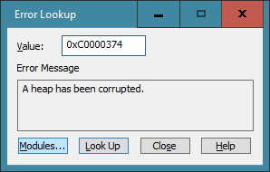
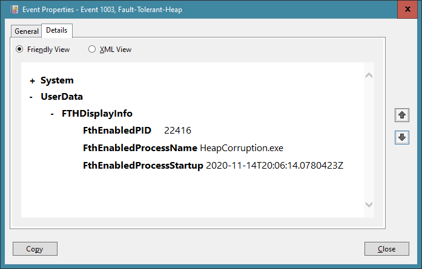
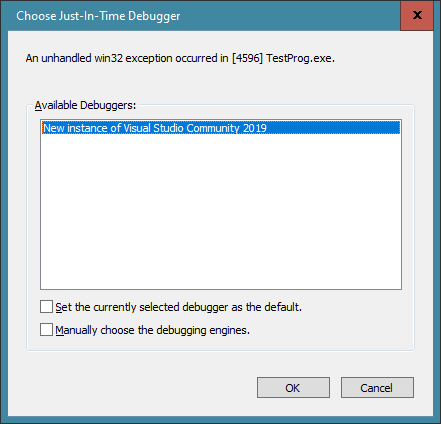
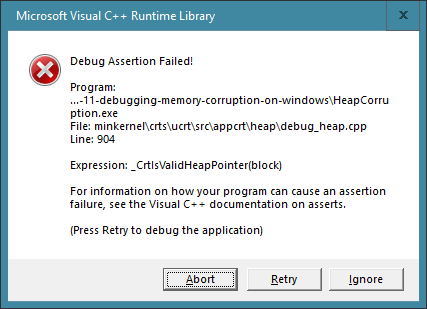

# Buffer Overflows on Windows and how to find them
Roger Orr

## Introduction

A _buffer overflow_ occurs when a program writes past the end of a fixed length block of memory. They typically produce some of the most "interesting" bugs in IT and, while they have been around for a long time, they also have become even more of a focus in the current landscape because of the possibilities of exploiting them in various types of malware.

These errors are mostly associated with programs written in C or C++ as managed languages, such as C# or Java, are far less prone to buffer overflows. This is because the normal programming environment in such languages enforces bounds-checking on all buffer accesses. However buffer overflows can, and do, still occur if, for example, the language provides "unsafe" features or there are bugs in the underlying runtime.

## What are the consequences of a buffer overflow?

One of the problems with a buffer overflow is that the consequences are hard to predict. This is specifically called out in the C (and C++) standard as **undefined behaviour** - and the standard "imposes no requirements" on the resulting behaviour. It depends what the memory being overflowed into is being used for; or more precisely what it _would_ have been used for in the subsequent execution of the program.

In practice, provided that the data overwritten is not critical to the execution of the program, some undefined behaviour may be ignored completely.

Common symptoms, where the data that is overwritten is more important, are an application producing **corrupted output** or **crashing** (for example when a pointer value is corrupted). However in most real applications the symptoms may vary, as memory usage patterns are not identical from run to run and the use of Address Space Layout Randomization (ASLR) means the addresses, and hence pointer values, used by the program are not the same on every invocation. One very typical symptom of buffer overruns is a program that _sometimes_ crashes.

This makes the problem both hard to find and hard to fix. It is hard to find because there is usually no obvious connection in the **code** between the buffer that overran and the location of the visible symptoms. The unpredictability of the consequences of buffer overrun often mean that generating a reproducible test case may be a slow process, and often any changes made to the environment and the program itself may hide the symptoms. A further complication even after a buffer overrun is found is another consequence of this lack of direct connection between cause and effect: it can be hard to be sure that you have found the _real_ root cause - you have fixed _a_ bug, but was it _the_ bug?

## A worked example

We will begin with a trivial example, where the unpredictability is minimised. The following program takes a single argument, which specifies the number of copies of the '@' character to write into one buffer. After this a _different_ buffer is printed:

```c++
--- HeapCorruption.c ---
#include <stdio.h>
#include <malloc.h>
#include <stdlib.h>
#include <string.h>

int main(int argc, char** argv)
{
   int len = argc > 1 ? atoi(argv[1]) : 0;
   
   char *buffer1 = (char*)calloc(100, 1);
   char *buffer2 = (char*)calloc(100, 1);
   
   puts("Fill buffer 1");
   memset(buffer1, '@', len);
   
   puts("Print buffer 2");
   puts(buffer2);
   
   puts("Free buffer 2");
   free(buffer2);

   puts("Free buffer 1");
   free(buffer1);

   puts("So long, and thanks for all the fish");
}
```
(With a tip of the hat to Douglas Adams for the last line.)

Note: For anyone following along themselves, I compiled the program using the free ["Download Visual Studio 2019 for Windows and Mac"](https://visualstudio.microsoft.com/downloads/) (version 16.8.1) in a "x64 Native Tools Command Prompt for VS 2019" on Windows 10 Professional (version 2004).
To keep things minimal I am starting with the command line: `cl HeapCorruption.c`. Other versions of Visual Studio and/or Windows may produce slightly different results!

Since the two pointers point to distinct objects we wouldn't normally anticipate any interaction between the two actions, and as long as we avoid buffer overflow that is exactly what we see:

```c++
C:> HeapCorruption.exe 10
Fill buffer 1
Print buffer 2

Freeing buffer 2
Freeing buffer 1
So long, and thanks for all the fish
```
However, what happens if we pass in a command line argument that is **larger**  than the size of `buffer1`? 

## Invoking Undefined Behaviour

Let's try executing the command line: `HeapCorruption 101`. This causes the program to write 101 '@' characters into an array of only 100 characters and thereby introduce undefined behaviour. When I tried this the program produced _exactly the same output_ as before. The single byte after the end of the buffer obviously isn't that critical to this program....

How far we can go? I tried 102, 103, and 104 all of which worked as before with no visible problems. This could take a while - let's increase by 4 to 108:

```c++
C:> HeapCorruption 108
Fill buffer 1
Print buffer 2

Free buffer 2
```
Where has the _rest_ of the program output gone? The program didn't produce the expected text about buffer1 nor the goodbye message - it simply **terminated**  by default (we'll look at this again shortly.) We can get more information from the process exit code, which is captured in a Windows command prompt in the `ERRORLEVEL` (pseudo-) environment variable (see [ERRORLEVEL is not %ERRORLEVEL%](https://devblogs.microsoft.com/oldnewthing/20080926-00/?p=20743)):

```c++
C:> echo %ERRORLEVEL%
-1073740940
```

Wherever you get one of these large negative values from a Windows process exit code, the likelihood is that this is a Windows error code, or an NT status code. But which one?!

There are several ways to find the symbolic name of the status code returned. One way is to look in WinNt.h for the hexadecimal value (0xC0000374):

```c++
C:> grep C0000374 "C:\\Program Files (x86)\\Windows Kits\\10\\Include\\10.0.18362.0\\um\\winnt.h"
#define STATUS_HEAP_CORRUPTION           ((DWORD   )0xC0000374L)
```

Another way is to use the "Error Lookup" program, `errlook.exe`, that comes with Visual Studio - although for NT status codes such as this one you need to add NTDLL to the list of modules using the `Modules...` button. Having done this you will see:



A third way - and possibly the most common in practice - is to search the web for the status code. Note that a search for the hex value of the error code is usually more successful than one with the decimal value. In this case I struck lucky and the first hit I got for `0xc0000374` was a Microsoft Technet article which begins: "The exception code 0xc0000374 indicates a heap corruption."

So, whichever way we find it, this status code informs us that Windows both **detects**  we have had a heap corruption and also **terminates** the program (we'll come back to _where_ and _how_ this happens later.) Unfortunately though this early termination may not be noticed by the user of the program as there's no output text indicating an error.

Let's keep on adding four and see what happens... 112 produces the same output (and error code) as we saw for 108, but something different happens when I try 116:
```c++
C:> HeapCorruption 116
Fill buffer 1
Print buffer 2
@@@@
Free buffer 2
```
So in _this_ case we can see four '@' characters from buffer2 - these must have come from the buffer overrun off the end of buffer1 getting as far as buffer2! Let's try adding another four to get 120 - we should presumably now see eight '@' characters:
```c++
C:> HeapCorruption 120
Fill buffer 1
Print buffer 2

Free buffer 2
Free buffer 1
So long, and thanks for all the fish
```
This is mysterious - the buffer overrun now appears to have gone away. Even odder, when I go back and try values like 108, 112 and 116 again the behaviour we initially saw has _also_ changed.

In order to unpack this mystery we need to look further \'85 let's see if we can make sense of what is going on by using an interactive debugger.

## Using a debugger

The debugging experience is usually improved if we are able to add debug symbols to our binary, which is easily done with the MSVC toolchain by recompiling with `/Zi` using: `cl /Zi HeapCorruption.c`

We can then invoke the Visual Studio debugger for this program from the command line: `devenv /debugexe HeapCorruption.exe 120`

Once in Visual Studio pressing F10 (or Debug -> Step Over from the menu) takes us, all being well, to the first line of `main`
However, if at this point we look at the output window (using View -> Output from the menu) we see this line:

`FTH: (4740): *** Fault tolerant heap shim applied to current process. This is usually due to previous crashes. ***`

## What is the Fault Tolerant Heap?

The fault tolerant heap is a Microsoft alternative to the regular heap, and it is normally switched on _automatically_ by Windows when a program has generated sufficient heap corruption errors. One of the earliest descriptions  of it was a blog post on Technet in 2009 in the "Windows 7" launch series: ["Windows 7 / Windows Server 2008 R2: Fault Tolerant Heap and Memory Management"](https://techcommunity.microsoft.com/t5/ask-the-performance-team/windows-7-windows-server-2008-r2-fault-tolerant-heap-and-memory/ba-p/374186).

The fault tolerant heap is designed specifically to work around common heap corruption bugs, such as the relatively short overrun in our test, by techniques such as allocating extra space at the end of each heap block.

While it can be explicitly requested by an application, the normal use-case is that the Windows "Diagnostic" services monitor application crashes that are caused by heap corruption, and enable the fault tolerant heap for such applications once the threshold is reached (and disables it again if it is no longer needed)

The fault tolerant heap is enabled during application start up if the appropriate registry value for the main program is set. In our case:
```c++
C:> reg query HKLM\\Software\\Microsoft\\Windows NT\\CurrentVersion\\AppCompatFlags\\Layers
c:\\temp\\heapcorruption.exe    REG_SZ    FaultTolerantHeap
```
While this behaviour makes a lot of sense for the majority of the Windows user base in that it may enable a program that causes heap corruption to be "fixed up" automatically and thus avoid crashes or data corruption, it is less useful for a _developer's_ machine where early notification of a bug in their program would be more useful.

Additionally, the fault tolerant heap is significantly slower than the the regular heap and may increase the memory footprint of the program while it is running as freed memory is not immediately reclaimed (this is done to provide protection against double-free bugs.)

You can track activity of the FTH subsystem in the Windows Event Log: expand "Application and Services Logs" -> "Microsoft" -> "Windows" -> "Fault-Tolerant-Heap" -> "Operational". Here we can see the event logged by the FTH system when the heap was applied to HeapCorruption.exe.



Fortunately this automatic control of the FTH can be disabled by a Windows policy or by writing 0 to the `Enabled` value in the registry key `HKLM\\Software\\Microsoft\\FTH`

However, this merely prevents the setting being applied to _new_ programs; you need to remove the value for the application in the earlier registry key if you wish to revert the setting for an application _already_ set.

You can turn the setting off for _all_ programs by opening an elevated command prompt and issuing the command:

`Rundll32.exe fthsvc.dll,FthSysprepSpecialize`

(although of course this may cause another program, currently functioning correctly after application of the FTH, to crash on future invocations.)

One difficulty with the whole mechanism is that, if you are developer on a corporate PC where you do not have admin rights, there is little you can do directly to turn the FTH off since to modify the registry keys involved requires admin rights. One thing you _can_ do is to run the program again with a _more_ severe buffer overrun - after a few occurrences of a heap failure that exceeds the protections of the FTH Windows turns the FTH off for the program.

So with this example program, running it with the argument of 180 a few times was enough to clear the registry key for `heapcorruption.exe`.

Now if we run `HeapCorruption.exe 120` under the Visual Studio debugger we use the normal heap and when we run the program we hit a software breakpoint. The Output windows shows:

`Critical error detected c0000374`
`HeapCorruption.exe has triggered a breakpoint.`

The call stack shows that we are in the call to `free(buffer2)`. So the heap manager has detected the corruption - when the corrupted heap cell was freed.

When run from the command line rather than inside a debugger, the same error is detected -- and this becomes the return code that we saw produced by the executed program. However, by default, the program is simply terminated at this point.

## Proactive debugging

As a developer I typically want to investigate problems when they occur and not have the system pre-emptively terminate the process. In the early days of Windows a program producing a heap corruption like this when **not** started under the control of a debugger would give you the option of attaching a debugger; sometimes called 'Just in time' (JIT) debugging.

This behaviour is still _available_ in Windows 10 but it is not the normal default - see for example [C++ JIT Debugging does not work in Windows 10 1803](https://developercommunity.visualstudio.com/content/problem/314418/c-jit-debugging-does-not-work-in-windows-10-1803.html). There are various policies available to manage this, but as a user of Windows 10 you can usually simply set a registry key to turn on this JIT debugging behaviour (unless other policies applying to your machine over-ride this!)

For example, by applying a .reg file with the folllowing contents:
```c++
Windows Registry Editor Version 5.00

[HKEY_CURRENT_USER\Software\Microsoft\Windows\Windows Error Reporting]
"DontShowUI"=dword:00000000
```
(It is a sort of "double-negative" - explicitly setting don't show UI to 0 (off) enables showing the error reporting UI)

Having done this, and restarting Windows, executing `HeapCorruption.exe 120`  from the command prompt produces a dialog box allowing us to attach a debugger to the crashing program:



However we are not finished with heap managers as Microsoft has yet another heap manager implementation available for us to try.

## The Debug Heap (WIN32)

The Win32 heaps have a range of configurable options, including settings to add space to head and tail of each block and to validate heap parameters. By default, when a process is started **under a debugger**  the system automatically enables these three settings for all heaps.

While this has some advantages, it does have some disadvantages too. The changed heap strategy means the program behaves _differently_ when being debugged which can make it harder rather than easier to locate problems and additionally the extra checking can significantly increase both the memory use and execution time of the program.

For this reason Windows suppresses the debug heap if the environment variable `_NO_DEBUG_HEAP` is defined with the value of 1.

More recent versions of Visual Studio set this option by default for processes they start; older versions did not (nor does Windbg - it provides a `-hd` command line option to do this.)

With Visual Studio 2019 there is an option to enable the debug heap in Tools -> Options -> Debugging check the option "Enable Windows debug heap allocator (Native only)".

The Microsoft blog post announcing this change ([C++ Debugging Improvements in Visual Studio "14"](https://devblogs.microsoft.com/cppblog/c-debugging-improvements-in-visual-studio-14/))) explained that one reason for it is that the C runtime _also_ has its own heap checking functionality, and is it to this that we turn next.

## The Debug Heap (CRT)

With an MSVC 'release' build the calls to memory allocation functions such as `calloc` and `free` in our program are simple shims on top of the underlying WIN32 Heap calls. With a 'debug' build MSVC provides a debugging heap manager in the C and C++ runtime library which sits on top of the underlying Win32 heap manager and adds additional bookkeeping information to each allocated block of memory. See [CRT Debug Heap] for more details.

So let us re-compile our program with the debug version of the runtime library:

`cl /MTd /Zi HeapCorruption.c`

Now when we execute HeapCorruption.exe 101 we get a dialog box telling us we have heap corruption:



This is stricter than the usual behaviour since we get a notification even in the case of a single byte overrun; in our earlier testing a single byte overrun was not detected. As a developer this is a good thing as it enables finding buffer overruns earlier. 

The dialog tells us to click `Retry` to debug the problem. (Sadly, on recent Windows builds, the button simply ends the program unless we have enabled JIT Debugging as mentoned above.)

There are additional options available with the debug heap and some run-time functions that can perform additional checks -- look on the Microsoft website for more details about this; for example [CRT Debug Heap Details](https://docs.microsoft.com/en-us/visualstudio/debugger/crt-debug-heap-details?view=vs-2019).

## Address Sanitizer

The techniques above all detect the problem _after_ the memory corruption has actually taken place. While in some cases this is not a problem, as the detection is close enough to the corruption that it is straightforward to identify, in other cases this delay in detection makes it extremely hard to find the root cause.

One additional tool that has recently been added to MSVC is **address sanitizer** . This was originally developed by Google for clang, and was included in version 3.1. It has since been included in gcc (since 4.8) and now it also appears in MSVC (since 16.4).

The tool works by adding instrumentation to the program and managing a section of 'shadow memory' to track the usages atate of byte of main program memory.

It's great advantage is that it proactively determines memory corruptions like the one in our example program.

We can enable it for our simple program like this:

`cl`**`/fsanitize=address`**` /Zi HeapCorruption.c `**`clang_rt.asan-x86_64.lib`**

(See [Address Sanitizer for Windows: x64 and Debug Build Support](https://devblogs.microsoft.com/cppblog/asan-for-windows-x64-and-debug-build-support/) for more details, such as the libraries needed to be supplied in different build configurations.)

Now when we run the program the corruption is detected and additional information is logged; there's quite a bit so I have slightly simplified the output shown here:
```c++
C:> HeapCorruption.exe 120
Fill buffer 1
=================================================================
==6616==ERROR: AddressSanitizer: heap-buffer-overflow on address 0x1155b8900414 at pc 0x7ff745e67329 bp 0x0005307af940 sp 0x0005307af958
WRITE of size 120 at 0x1155b8900414 thread T0
    #0 0x7ff745e6735b in __asan_wrap_memset 
    #1 0x7ff745e51413 in main HeapCorruption.c:19
    #2 ...

0x1155b8900414 is located 0 bytes to the right of 100-byte region [0x1155b89003b0,0x1155b8900414)
allocated by thread T0 here:
    #0 0x7ff745e534ee in calloc asan_malloc_win.cc:129
    #1 0x7ff745e513d7 in main HeapCorruption.c:15
    #2 ...

SUMMARY: AddressSanitizer: heap-buffer-overflow ... __asan_wrap_memset
Shadow bytes around the buggy address:
  0x036a6fa20030: fa fa fa fa 00 00 00 00 00 00 00 00 00 00 00 00
  0x036a6fa20040: 00 03 fa fa fa fa fa fa fa fa 00 00 00 00 00 00
  0x036a6fa20050: 00 00 00 00 00 00 00 04 fa fa fa fa fa fa fa fa
  0x036a6fa20060: 00 00 00 00 00 00 00 00 00 00 00 00 00 fa fa fa
  0x036a6fa20070: fa fa fa fa fa fa 00 00 00 00 00 00 00 00 00 00
=>0x036a6fa20080: 00 00[04]fa fa fa fa fa fa fa fa fa 00 00 00 00
  0x036a6fa20090: 00 00 00 00 00 00 00 00 04 fa fa fa fa fa fa fa
  0x036a6fa200a0: fa fa fa fa fa fa fa fa fa fa fa fa fa fa fa fa
  0x036a6fa200b0: fa fa fa fa fa fa fa fa fa fa fa fa fa fa fa fa
  0x036a6fa200c0: fa fa fa fa fa fa fa fa fa fa fa fa fa fa fa fa
  0x036a6fa200d0: fa fa fa fa fa fa fa fa fa fa fa fa fa fa fa fa
Shadow byte legend (one shadow byte represents 8 application bytes):
  Addressable:           00
  Partially addressable: 01 02 03 04 05 06 07
  Heap left redzone:       fa
  Freed heap region:       fd
  Stack left redzone:      ...
==6616==ABORTING
```
Address sanitizer can be used in conjunction with a debugger, but in practice the provision of the location of the address causing the corruption and the call stack at that point, together with the call stack of where the memory was originally allocated, may well be sufficient information to identify the bug without needing any further information. That is indeed the case here, in this simple example.

I personally find address sanitizer an invaluable tool when using clang or gcc and I am really looking forward to being able to use it also when programming with MSVC.

## What else is there?

There are a host of other techniques that can be useful for debugging memory corruptions on Windows. Some are additional Microsoft tools, for example "Debugging Tools for Windows", others are open source or are available commercially.

While this could be a fascinating subject for a different article, I have restricted this one to describing the basic facilities that come 'out of the box' with a Visual Studio installation on Windows.

## Summary

This article has looked at a single example of a buffer overrun and shown how the symptoms of the resultant memory corruption play out in various scenarios when using MSVC on Windows.

I hope the article has helped to explain what happens 'under the covers' and also shown a few useful techniques to help you find and resolve similar problems you may encounter in programs you are developing.

If you are able to use a recent version of Visual Studio in your development environment I strongly suggest you become familiar with the use of address sanitizer.

<hr>
Copyright (c) Roger Orr 2020-12-10 11:32:41Z (First published in CVu Jan 2021)
