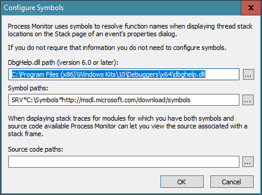
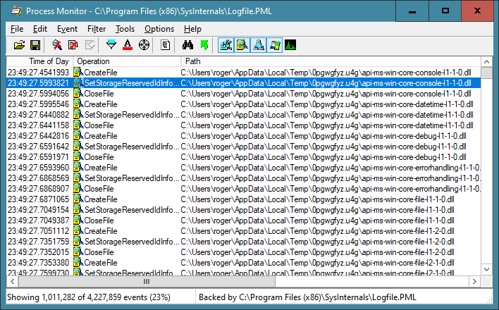
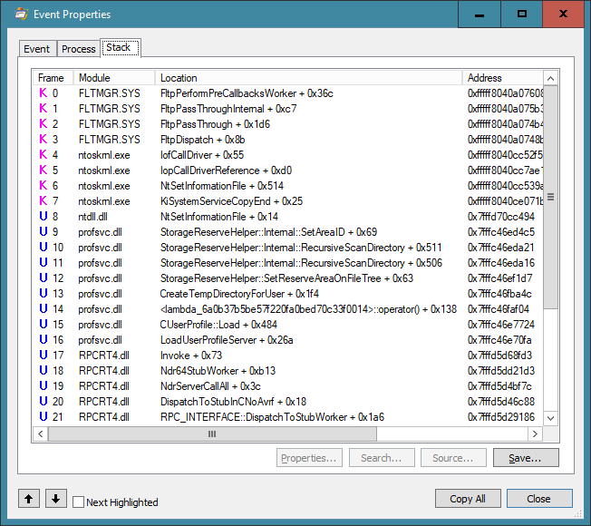
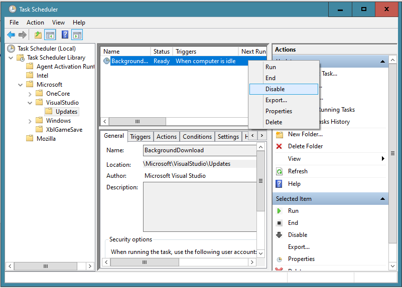

# A War Story: Debugging a Slow Windows Logon
Roger Orr

## Introduction

I recently had a
problem with my laptop, which I have now successfully resolved. A couple of people thought it might be interesting to write
this up for CVu as an example of the sorts of tools and approaches that can be used to solve problems like this.
There are of course many different ways to proceed in cases like this and one of the things I personally gain from hearing
_other_ people's war stories is when I learn about a technique I was previously unaware of.

To set the scene, my Windows 10 laptop was getting very slow to start up after a full shutdown.
While a full shutdown is not _that_ 
common after I missed fifteen minutes of an important Skype call because I had to do a system restart to get Skype 
to work I decided enough was enough.

## But first - what is a "full" shutdown?
 
As you may already know, Microsoft now enables "Fast Startup" by default for Windows which means that when you click
the power off icon on the start menu Windows closes your open programs and files but saves the rest of the current
system state to the hard drive and then turns off the power. When you next turn on the computer the kernel of the 
system is recovered from the saved disk image rather than being completely rebuilt from scratch.
This is designed to make the common case, where the same person logs on to the computer all the time,
faster - in some cases much faster. (It is a sort of half-way house between a full power down and hibernation.)

However there are times when Windows does need a full close down to ensure a clean copy of everything is re-read from disk.
For example, this is required after you have updated system components or installed a new hardware driver to ensure
the changed system setup is loaded up. The Restart button by default performs a full close down before it restarts.
You can also force full shutdown by holding the Shift key when pressing the shutdown icon. 

## What is _actually_ the slow part?

One of the problems with a slow logon is that all you can see on the screen is a spinning circle;
you are of course not logged on yet
and so cannot easily investigate what is, or is not, happening on the computer.

However, there is a registry setting you can use that makes the start up and logon process produce more of a progress report.

The following command, when run in an elevated command prompt, turns this on:
```
reg add HKEY_LOCAL_MACHINE\SOFTWARE\Microsoft\Windows\CurrentVersion\Policies\System /v verbosestatus /t REG_DWORD /d 1 /f
```

Once this was enabled I could see that the slow part was while running the **User Profile Service**, or **UserProf**.

As an aside, I intend to enable this registry setting on Windows computers in the future, when I have the admin rights
necessary, as the additional information it gives may prove to be useful for debugging other startup/logon issues.
 
## Google _may_ be your friend

I began my investigation by searching the Internet for reports of people resolving similar symptoms with the
User Profile Service. There was no shortage of material, much of which referred to problems with slow networking
or access to domain controllers.

While my laptop is not part of a domain, it_ is_ 
in a workgroup, and so it seemed that it would be worth starting by trying some of the more relevant looking 
of the suggested fixes. For example, I tried out this one which looked fairly safe (and easy to back out if necessary):

```
Local Group Policy Editor
-> Computer Configuration
  ->  Administrative Templates
    -> System
      -> User Profiles
        Set max wait time for the network to 1 
```

Sadly though _none_ of the network related modifications I tried made any perceptible change to the slow logon problems I
had after a full shutdown.

I did also find some reports of problems with the User Profile Service that were caused by a corrupted user profile.
Perhaps the root cause of my problem was something specific to my user account on the computer?

## Create a doppelgänger

This hypothesis was easy to test. I simply created a new user, "Visitor", on my laptop, as a regular user with no special
permissions and linked to no Microsoft account. I found by testing with _this_ account that I could perform a full
shutdown and log back on **without** 
the long delay. This was good - the problem was getting slightly narrowed down.

I could of course have cut my losses here: switched to a new account in preference to my existing one.
However in the short term this would have meant a lot of work re-installing and/or re-configuring a lot
of programs and settings, and in the longer term the same problem might recur with the new account.
I continued to investigate further. 

Once you have a couple of accounts, other things become possible. I realised I could perform a logon to my own account
_from within_ the Visitor account by using the Windows `runas` command.

The `runas` command is provided as part of Windows to allow a user to run specific tools and programs with different
permissions than the user's current logon provides. In this case, I simply wanted to use it to force the system to
log on my 'real' account.

I executed the following to try and create a command shell running as 'me':

`runas /user:roger %comspec%`

This command took 12 minutes to complete. It seemed clear I had managed to trigger exactly the same issue as the logon
problem I started with. However, it was now occurring _while I was on the computer_ and so I could investigate further.

The first tool to try was the task manager - only a keystroke away (Ctrl+Shift+Esc); the Performance tab showed me **100%** 
disk use for the duration of the logon, with only fairly trivial amounts of CPU, memory, and network utilization.

I repeated the exercise, but this time I attempted to open the Resource Monitor
(available from within Task Manager). Unfortunately this requires admin privileges to run effectively,
so of course when I tried running it I was asked to enter the details for my administrator account,
which resulted in a login.... At this point I belatedly realised that the _user_ account I'd created
wasn't sufficient to let me investigate much further! 

I went back into the User Account management and created another account, "Test", this time an _administrator_ 
account, and performed another full shutdown and logon. I could now open the Resource Monitor using my Test
admin user to show me more information about the activities on the system and I then invoked the `runas` command again.

Unfortunately despite sorting the data available in various ways and staring at on the screen for some time during
the login I failed to identify exactly what was causing so much disk utilization.
The only profile-related file I could see being accessed was
`C:\\Users\roger\AppData\Local\Microsoft\Windows\usrClass.dat`
(which holds part of the Windows registry) but the total accesses to this file did not appear to amount to enough
to be the reason for the delay. I needed to reach for a slightly different tool.

## Process Monitor

Most Windows developers have at some time or another stumbled across the SysInternals suite of programs; many of us find 
them an absolutely essential set of utilities for serious work on Windows.
Originally known as NtInternals the programs were written by software developers Bryce Cogswell and Mark Russinovich.
Microsoft bought their company and its assets in 2006 but fortunately the programs are still being updated and
are available for free from Microsoft's website [SysInternals](https://docs.microsoft.com/en-us/sysinternals/).

There are a wide range of tools in the suite and I would encourage you to in
vestigate what is available if you have not previously come across them. In this case the most appropriate tools seemed
to be Process Monitor, which provides a real-time view of the system accesses (File System, Registry, etc.) made across
_all_ the processes running on the machine.

For best results, ensure you configure the symbol server settings in Process Monitor to allow it to get Windows symbols
from Microsoft's website for system DLLs, for example something like this:



For my next test login I fired up Process Monitor, as the "Test" user, added a filter for "Event Type" of "File System" 
and then executed the `runas` command as before ... and thousands of items flooded the Process Monitor window.
I left the monitoring process running until the `runas` command had successfully launched the command prompt and then
stopped capturing and saved the file (which weighed in at well over 2GB (!)).

Among the many events I quickly spotted a repeated sequence of calls from "`svchost`" of
`CreateFile`, `SetStorageReservedIdInformation`, and `CloseFile` for a long series of filenames with names like
`C:\Users\roger\AppData\Local\Temp\0pgwgfyz.u4g\api-ms-win-core-console-l1-1-0.dll`.
I added another filter for "PID" matching this instance of `svchost` to help me drill into this further.



First I clicked on one of the rows in the display containing a call to `SetStorageReservedIdInformation`,
selected the 'Stack' panel and waited for the call stack to appear.



Hmm, that's interesting -- looking at the names in the call stack on this, and subsequent, items, it appear that
the process is recursively scanning the entire contents of my temp directory during login and setting some
attribute on all the files (and directories) it finds. 

I saved the filtered data as a CSV file for further investigation using text based tools like `grep`.

First I checked what _other_ file accesses svchost was making:

```
wc Logfile.CSV
1013859  10530811 264704126 Logfile.CSV
grep -v -c "Temp\\" Logfile.CSV
10515
```

This clearly showed that over 99% of the filtered records were for accesses to files in the temp directory.

I picked out references to the filename above ("api-ms-win-core-console-l1-1-0.dll" in sub-directory "0pgwgfyz.u4g"
of "C:\Users\roger\AppData\Local\Temp") and found, somewhat to my surprise, that the _identical_ sequence of three
operations was performed _twice _ about ten minutes apart during the logon.

```
23:49:27.4541993 "CreateFile"
23:49:27.5993821 "SetStorageReservedIdInformation"
23:49:27.5994056 "CloseFile"
...
00:01:18.9971105 "CreateFile"
00:01:18.9971599 "SetStorageReservedIdInformation"
00:01:18.9971716 "CloseFile"
```

While this is very curious, I now knew what to do to improve the speed of logging on! I deleted the contents of
the temp directory. I had to use an elevated command prompt as many of the directories in the temp directory were
not removable using my default user permissions. There were also a couple of log files that couldn't be deleted
as they were in use.

I then did another full shut down and logon as "Roger" now worked in a properly short time.

Hurrah!

## What were all these files?`

One obvious question is what were all these files doing in the temp directory in the first place?
The bulk of them appeared to be from two causes:

(1) directories with a random looking 8.3 filename containing what looks like a Visual Studio installation program.
I had no idea why there are multiple copies of this appearing in my temp directory; maybe I have some sort of issue
with one of my Visual Studio installations and/or maybe it is simply the system repeatedly attempting to download updates?
Nothing is reported by my virus checker nor by an online checker.

However, a search for "visual studio installer keeps appearing in my temp directory" found an article
 [VsInstaller](https://developercommunity.visualstudio.com/content/problem/1072966/visual-studio-installer-leaves-growing-collection.html) 
 and I have applied the suggested solution as shown below, time will tell how successful it is.



(2) directories with a GUID for their name, owned by the administrator. Some of these contained an empty directory named "en-US".
There was little to go on for tracking down the source of these files.

## How can I stop the problem recurring?

Left to itself the problem looks likely to recur. Since I don't yet know what's writing all the fiules and directories
it may prove difficult to prevent it. The simplest solution would be for the system to erase the temp directory on
logoff - it is _supposed_ to be temporary after all! It's possible there is a setting somewhere in Windows that enables
this - if you know, please let me know! Failing that, either running disk cleanup regularly or adding a simple command
file to run at startup that deletes any sub-directories in the temp directory.

## Reflection

This article describes what I did to solve a specific problem I had with logging on to Windows. I hope that people will be
able to spot places where I could have done a better job, either by doing things in a different order or by using a different tool.

However, my hope is that people will learn something new about the possible tools and approaches that may help them attack
similar problems in the future.

<hr>
Copyright (c) Roger Orr 2021-03-06 14:42:22Z
First published in CVu, March 2021
