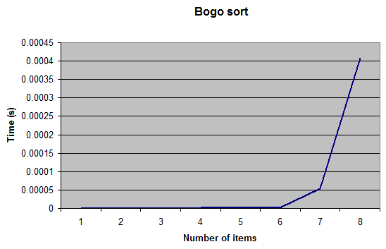

# Order Notation in Practice

What does complexity measurement **mean**?

(This article is based on the presentation of that title at ACCU 2014)

## Introduction

Most computer programmers have heard of Order Notation -- if you have studied computer science then it's
almost certain you'll have studied this at some point during the course.
The notation is a way of describing how the **number of operations** performed by an algorithm varies by
the **size of the problem** as the size increases.

But why do we care? Almost no-one is actually interested *directly* in this measure - but many people
do care greatly about the performance of a function or algorithm. The complexity measure of an algorithm
will *affect* the performance of a function implementing it, but it is by no means the **only** factor.

There are a number of different ways to measure the performance of a function, with overlap, or at least
strong correlation, between many of them. Examples of common performance measures include:
- Wall clock time
- CPU clock cycles
- Memory use
- I/O usage (disk, network, etc)
- Power consumption

Complexity measurement is (normally) used to approximate the number of operations performed and this is
then used as a proxy for CPU clock cycles and hence performance (or at least one of the measures of performance).
However, it is a simplification of the overall algorithm; it may be a measure of only one of the operations
involved and it may ignore other factors, such as memory access costs that have become increasingly important in recent years.

## Introduction, or re-introduction, to order notation

Order Notation is a classification of algorithms by how they respond to changes in size.
It uses a big O (also called Landau's symbol, after the number theoretician Edmund Landau who invented the notation).
We write `f(x) = O(g(x))` to mean

*There exists a constant **C** and a value **N** such that **|f(x)| < C|g(x)| ∀ x > N***   

There may be a variety of possible ways of picking **C** and **N**. For example, consider the functions:
<code>f1(x) = 2x<sup>2</sup> + 3x + 4</code> and <code>f2(x) = x<sup>2</sup> + 345678x + 456789</code>.

For `f1` we notice that `3x + 4` is less than <code>x<sup>2</sup></code> when `x` is bigger than four.
Hence `f1(x)` < <code>3x<sup>2</sup></code> , for x > 4. So we get `C` =`3` , `g(x)` = <code>x<sup>2</sup></code> and `N` =`4`.

For `f2` the numbers are a little larger but a similar method leads to seeing that `f2(x)` < <code>2x<sup>2</sup></code>
for all values of x > 345678 and hence get `C` =`2` , `g(x)` = <code>x<sup>2</sup></code> and `N` =`345678`;
or we might start with a larger value for `C` , say 4000, and then have `f2(x)` < <code>4000x<sup>2</sup></code> for all
values of x > 87 hence get `C` =`4000` , `g(x)` = <code>x<sup>2</sup></code> and `N` =`87`.

For the purposes of order notation it doesn't matter what `C` and `N` are nor how large or small they are - they are constants;
the important item is the function `g()` - in this example both `f1` and `f2` are the *same* complexity,
<code>O(x<sup>2</sup>)</code>. In simple polynomial functions like these you don't need to do the full analysis to find C and N
as the complexity is simply the biggest power of `x` .

With more complex formulae it can be much harder to come up with appropriate constants and expressions; fortunately the
complexity for many common algorithms is well-known (as we shall illustrate below).

Note too that for the `O` measure of complexity the function `g` may not be the *smallest* value needed. `f3(x) = 16`
would usually be described as `O(1)` but *can* also be described as <code>O(x<sup>2</sup>)</code> (with C=1 and N=4)
but like any estimate it's normally more useful the 'closer' it is and this function. This matters more for non-trivial
algorithms where it may be very hard to exactly specify the best complexity function but much easier to specify a slightly larger one.

There are other symbols used in order notation such as the little-`o` symbol and the big-theta symbol. For example if both
`f(x) = O(g(x))` and `g(x) = O(f(x))` then we can write `f(x) = θ(g(x))` . These are used in the mathematical theory of
complexity but are generally less common in computer science.

## Some common orders

Here a some common orders, with the slower growing functions first:
<code>O(1)</code> - constant<br>
<code>O(log(x))</code> - logarithmic<br>
<code>O(x)</code> - linear<br>
<code>O(x<sup>2</sup>)</code> - quadratic<br>
<code>O(x<sup>n</sup>)</code> - polynomial<br>
<code>O(e<sup>x</sup>)</code> - exponential

## Order arithmetic
When two functions are combined the order of the resulting function can (usually) be inferred quite simply from the orders
of the original functions. When adding functions, you simply take the biggest order. For example `O(1) + O(n) = O(n)`

When multiplying functions, you multiply the orders, For example <code>O(n) * O(n) = O(n<sup>2</sup>)</code>

So, more generally, when a function makes a *sequence* of function calls the overall order of the function is the same as the highest
order of the called functions.
```
void f(int n) {
  g(n); // O(n.log(n))
  h(n); // O(n)
}
```
In this example `f(n) = O(n.log(n))` . This highest order is sometimes called the *dominant* complexity since as the number of
items increases this value will dominate the overall complexity of the whole calculation.

For a function using a loop the order is the product of the order of the *value* of the loop count and the loop body

```
void f(int n) {
  int count = g(n); // where the value of count is O(log(n))
  for (int i = 0; i != count; ++i) {
    h(n); // O(n)
}
```
Hence in this example too `f(n) = O(n.log(n))`

Many standard algorithms have a well-understood order. One of the best known non-trivial examples is probably quicksort
which "everyone knows" is `O(n.log(n))` . Except when it isn't, of course! On *average* it is `O(n.log(n))` but the
worst-case complexity, for particularly unhelpful input values, is <code>O(n<sup>2</sup>)</code>.

Also, this is the computational cost, in terms of the number of **comparison** operations, not necessarily all operations or the memory cost.

The C++ standard mandates the complexity of many algorithms, using various different operation counts.

For example,
- <code><i>container</i>::size</code>:
"Complexity: constant."
- `std::list::push_back`:
"Complexity: Insertion of a single element into a list takes constant time and exactly one call to a constructor of T."

There are also various flavours of sorting. For example,
- `std::sort`:
"Complexity: `O(N log(N))` comparisons."<br>
- `std::stable_sort`:
"Complexity: It does at most <code>N log<sup>2</sup>(N)</code> comparisons; if enough extra memory is available, it is `N log(N)`."
(The standard is silent on what 'enough' means!)
- `std::list::sort`:
"Complexity: Approximately `N log(N)` comparisons"

The .Net documentation also provides complexity for (some) algorithms. For example
- `List<T>.Sort` :
"On average, this method is an `O(n log n)` operation, where n is Count; in the worst case it is an <code>O(n<sup>2</sup>)</code> operation."

Java too provides complexity measures for some algorithms. For example
- `Arrays.sort` :
"This implementation is a stable, adaptive, iterative mergesort that requires far fewer than `n lg(n)` comparisons when the input array is partially sorted, while offering the performance of a traditional mergesort when the input array is randomly ordered..." 

(The Java spec uses `lg` rather than `log` - but all logarithms have the *same* complexity so it is immaterial!)

However, unlike C++, neither .Net nor Java seem to provide much detail for the cost of *other* operations with containers.
This makes it harder to reason about the performance impact of the choice of container and the methods used: not everything
is dominated by the cost of sorting alone!

So that's the theory; what happens when we try some of these out in an actual program on real hardware? Your
own figures may vary because of machine and operating system differences (different clock speeds, varying amounts
of memory, different speeds of memory access and cache sizes and different choices of memory allocation strategies).

## strlen()

This seems like a straightforward function and at first sight measuring its complexity should be simple enough:
`O(n)` where n is the number of bytes in the string. You may even have read some example source code for `strlen()`
if and when you first learned C.

```
int strlen(char *s) /* source: K&R */
{
  int n;

  for(n = 0; *s != '\\0'; s++)
  {
    n++;
  }
  return n;
}
```
Have you looked inside `strlen()` recently? Things have got much more complicated than this in practice!
Here's an extract from an implementation of the function on x64 - probably rather more than you wanted to know...

```
strlen:
    mov     rax,rcx                   ; rax -> string
    neg     rcx
    test    rax,7                     ; test if 64 bit aligned
    je      main_loop
    ; ...
    ; loop until aligned (or end of string found)
    ; ...
main_loop:
    mov     r8,7EFEFEFEFEFEFEFFh
    mov     r11,8101010101010100h
    mov     rdx,qword ptr [rax]       ; read 8 bytes
    mov     r9,r8
    add     rax,8
    add     r9,rdx
    not     rdx
    xor     rdx,r9
    and     rdx,r11
    je      main_loop
    mov     rdx,qword ptr [rax-8]     ; found zero byte in the loop
    test    dl,dl
    je      byte_0                    ; is it byte 0?
    test    dh,dh
    je      byte_1                    ; is it byte 1?
    shr     rdx,10h
    ; ... and the rest
byte_0:
    lea     rax,[rcx+rax-8]
    ret
```
However, despite the re-write in assembly language and the tricks to enable checking 64 bits at once in the main loop this code is still `O(n)`.

Naively we write some code that calculates the elapsed time for a call to `strlen()` like this:
```
timer.start();
strlen(data1);
timer.stop();`
```
However, on most compilers in release mode the call appears to take **no time at all** ....
The reason for this is that calls to functions like  `strlen()` can be optimised away completely if the return value is not used.
It's vitally important with performance measuring to check you're measuring what you *think* you're measuring!

So we change the code to use the return value of `strlen()` and set up a couple of strings to test against:
```
char const data1[] = "1";
char const data2[] = "12345...67890...";
```
Compare time for `v1 = strlen(data1)` against `v2 = strlen(data2)`
Once again, you may get a bit of a surprise, depending on which compiler and flags you're using, as a call to `strlen()`
of a constant string can be evaluated at *compile* time and hence is **O(1)** (also known as constant time.) I repeat -
it's vitally important to check you're measuring what you *think* you're measuring!

So for our third attempt we set up the string at runtime and now we get the graph we were expecting that demonstrates `strlen()` is `O(n)`
 


Series 1 and Series 2 are two separate runs over the same range of lengths, and demonstrate how repeatable the results are.
However, this nice simple straight line graph breaks if we make the length a little larger.


The graph is no longer linear and also no longer as consistent between runs. The reason is the the machine I
used for this test has 2814Mb of RAM and the operating system starts swapping memory to disk as the size
of the string gets near to this value.

There is another anomaly with smaller strings too: this is present in the first graph above but not obvious
to the naked eye. If we change the graph to display the average time for each byte we can see a jump at
around 600,000 bytes:


Again, figures may differ on different hardware - **this** machine has 64K L1 + 512K L2 cache per core, ie. 589,524 bytes.
So here we can see the effect of the cache size of this test.

What we have demonstrated here is that the runtime execution time of `strlen()` is **O(n)** to a very good approximation
when n is between cache size and available memory. The complexity in terms of the number of access operations on the string
*is* still linear for larger strings than this but the effects of swapping dwarf this. It is likely that the cost of
swapping is also **O(n)**, but the "scaling" factor **C** is much bigger (perhaps 250 - 300 times bigger in this case on this hardware).

Let us see what happens if we try the same sort of operation but a slightly more generic algorithm by swapping
over from using `strlen()` to using `string::find('\0')`

We expect this will behave like `strlen()` and indeed it does - consistently slightly slower


## Sorting

We now turn our attention to various sorting algorithms and how they behave under various conditions. We start with a
(deterministic) **bogo** sort

```
template <typename T>
void bogo_sort(T begin, T end)
{
  do
  {
    std::next_permutation(begin, end);
  } while (!std::is_sorted(begin, end));
}
```
This is not a sort you ever want to use in production code as it has `O(n × n!)` comparisons. Except when it
doesn't - here are some timings.

10,000 items - 1.13ms<br>
20,000 items - 2.32ms<br>
30,000 items - 3.55ms<br>
40,000 items - 4.72ms

This appears to be `O(n)` - but how? I "cheated" and set the initial state carefully.
When measuring the performances of sorting you must be very careful about the best and worst cases. Make sure
you are testing against similar data sets to those you will experience in real executions! In this case, I changed
the generation of the data sets to use a randomised collection and then I obtained the expected sort of graph


I didn't do any runs with more than 14 items as the time taken was so long! You can see that we appear to hit a 'wall'
at 13 or 14 items. But appearances can be deceptive -- if we take the graph after eight items we get a similar 'wall' effect.



While graphs can make some things easy to visualise they can also slightly mislead the eye: the wall effect seen here
depends on the vertical scale of the graph.
What this means in practice is that the point at which the increasing complexity cost of a poor algorithm significantly
affects the **overall** performance of the whole function or program will depend on what the relative timings are
of the algorithm and the whole thing.

Let us leave the quaint bogo sort behind and try out some more performant flavours of sorting. `std::sort` which
is the commonest used in C++, `qsort` the equivalent for C, `bubble_sort` which is easy to explain and demonstrate,
`stable_sort` which retains the order of equivalent items and `partial_sort` which sorts the first 'm' items from 'n'
(in this test I sorted the "top ten" items).

(If you want to visualise some of these sort algorithms in practice I must mention
[AlgoRythmics](https://www.youtube.com/watch?v=ywWBy6J5gz8) - illustrating sort algorithms with Hungarian folk dance.

The dances do help to give some idea of how the algorithm works - they also show the importance of the multiplier `C` in the formula)


This graph might help to explain a quote from Andrei Alexandrescu: "I'd like to go back in time and kill the inventor of bubblesort".
Removing this sort algorithm the graph now reveals the differences between the others:

\lang2057\f0

Notice that `std::sort` is faster than `qsort` which can come as a surprise to those who assume C is always faster than C++.
It also shows that you do seem to pay a small cost for the stability of `stable_sort` . However the real surprise for
many people may be the excellent performance of `partial_sort` which is considerably faster than all of the other
algorithms that sort the entire data set. When confronted with a sorting problem it is worth asking whether or not
you need the **full** set sorted - if you only need a small number of the top (or bottom) items then `partial_sort`
may prove to be a more performant solution.

However, that was with *randomised* input data - in practice a lot of real data is not randomly sorted. When sorting
*nearly *sorted data the bubble_sort algorthm can perform surprisingly well:


This demonstrates how important it is to test performance in an environment as similar as possible to the expected target -
many algorithms are sensitive to the input data set and if the test data set has different characteristics than the production
data you may make a non-optimal choice.

## Comparing and contrasting list and vector

The C++ collection classes, in common with some other languages, has a number of standard collection classes with slightly
different interface and implementation. Two of these are `std::list<T>` and `std::vector<T>`. Both contain an
ordered collection of values of type `T` , in the one case the underlying implementation is a doubly-linked list of nodes
and in the other it is a contiguous array of objects. The C++ algorithm std::sort can be used to sort the vector, but not
the list (since the list does not provide a random-access iterator). However, there is a member function `sort` in
`std::list`. The complexity measure of `std::sort` is the same as `std::list::sort` - so what's the difference in practice?

In terms of implementation, sorting a vector must actually copy the objects around inside the underlying array; whereas
sorting a list can simply swap around the forward and back links without needing to move the payloads.

So let's try it. The next graph plots two things at once: on the left hand axis we have the time to sort the collection
and on the right hand axis the actual number of comparison operations performed (since the complexity is stated in terms
of the number of comparisons).


There are several points to note in this graph. Firstly, sorting the vector involves performing nearly twice as many
comparisons as for the list when sorting the **same** data set, so while both are of the same theoretical complexity
(`n.log(n)` ) the scaling of this (`C` from the formula at the start of this article) is different. However, even
though list does far fewer comparisons it is consistently slower than vector and gets more so as the number of items
sorted increases.

This is a 'worst case' example as the object I used for this example merely wraps an integer, and so it is actually
quicker to move the payload (1 machine word) than to swap the pointers in the list (2 machine words)!

The obvious question then is what happens as the size of the payload increases. If we retain the original payload
as the 'key' comparison value then number of comparisons  will remain exactly the same, the only change will be
in the amount of data moved (for the vector). The list will continue to swap pointers and doesn't need to even
access the whole object.

I repeated the test above with gradually increasing sizes of payload for both vector and list. As expected,
as the payload increased, the performance of the vector dropped until it eventually approximately equalled
that of the list and then lagged behind it. However, I was surprised how large the payload size needed to be
before this approximately equal performance was achieved: for *this* test on *my* hardware it was at around
**100 bytes**. I would have expected the increasing cost of copying to have had its effect more quickly.

One of the reasons is that, as we are all gradually coming to understand, modern computers perform very much
better on data with good locality of reference. A vector is about as good as you can get in the regard - the
objects in the vector are contiguous in memory and there are no additional control structures involved inside
the data. While the specifics vary, the principle of locality is important and if it is *multiplicative* with
the algorithmic complexity it can change the complexity measure of the overall function.

The performance of the list test is instructive in this regard: as discussed above when using the same value for
the comparison the sort is doing **exactly **the same sequence of comparisons and link swaps. I found that sorting
a list with a 1Kb payload took between two and three times as long as sorting a list of integers. At first I
thought there might be a simple relation to the cache line size and that once the object payload exceeded the
cache size (64b on my hardware) there would be no further effect on performance; but this did not seem to be the
case. See below, the graph of time against the number of items sorted and the log of the object size.


Perhaps we should be measuring the complexity of sort algorithms in other terms than just the number of comparisons?

## Cost of inserting

Suppose we need to insert data into a collection and performance is an issue. Looking at the various standard containers
we might be using, what might be the differences between using: `std::list` , `std::vector` , `std::deque` , `std::set` , or` std::multiset` ?

To refresh your memory, the cost of inserting for each of these is:
- std::list "constant time insert and erase operations anywhere within the sequence"
- std::vector "linear in distance to end of vector"
- std::deque "linear in distance to nearer end"
- std::set & std::multiset "logarithmic"

We are also affected by the time to find the insert point.
I tested randomly inserting 10,000 items into the various collections, with the following results:
- `std:list` ~600ms
Very slow - cost of finding the insertion point in the list
- `std::vector` ~37ms
Much faster than list even though we're copying each time we insert
- `std::deque` ~310ms
Surprisingly poor - spilling between buckets
- `std::set` ~2.6ms -- our winner!

It can be significantly faster to use a helper collection if the target collection type desired is costly to create.
In this example, if I use a `std::set` as the helper object and then construct a `std:list` on completion of the inserts
then the overall time to create the sorted list drops to **~4ms**. The use of a helper collection will obviously increase
the overall memory use of the program at the point of converting the source to the target collection, but the performance
gains can be considerable.

If we change the insertion order from a random one to inserting 10,000 already sorted items, then the performance
characteristics change again (there are two choices of sort order to select whether items are added to the front
or to the back of the collection):
- `std:list` ~0.88ms
Fast insertion (at known insert point)
- `std::vector` ~0.85ms (end) / 60ms (start)
Much faster when appending
- `std::deque` ~3ms
Roughly equal cost at either end; a bit slower than a vector
- `std::set` ~2ms (between vector and deque)

This article is about order notation, so what happens to these numbers if we change the number of items? Let us try using
ten times as many items:

- `std:list` ~600s (1000x)
- `std::vector` ~3.7s (100x)
- `std::deque` ~33s (100x)
- `std::set` ~66ms (33x)

The cost of finding the insertion point for std::list dwarfs the insert cost. It is easy to overlook  parts of an algorithm
to discover later they have added significant hidden complexity.

## Can we beat std::set ?

C++11 has some additional associative collection classes that use hashing for improved performance (at the expense of
removing the natural sort order). If we try a naïve use of `std::unordered_set` we find it is very slightly *slower*
at 10K (~2.8ms vs ~2.6ms) but does out-perform std::set better at 100K items (~46ms vs ~66ms)

However, we may have additional knowledge about our value set and so can use a different hash function - as is the case
in my test program where a trivial, and fast, identity hash function can be used. This enabled std::unordered_set to
achieve times of ~2.3ms (10K) and ~38ms (100K).

## Conclusion
The algorithm we choose is obviously important for the overall performance of the operation (measured as elapsed time).
As data sizes increase we eventually hit the limits of the machine; the best algorithms are those that involve least
swapping. For smaller data sizes the characteristics of the cache will have some effect on the performance.

While complexity measure is a good tool we must bear in mind:
- What are N (the relevant size) and C (the multiplier)?
- Have we identified the function with the dominant complexity?
- Can we re-define the problem to reduce the cost?

## Making it faster

We've seen a few examples already of making things faster.
- Compile-time evaluation of strlen() turns O(n) into O(1)
- Can you pre-process (or cache) key values?
- Swapping setup cost or memory use for runtime cost
- Don't calculate what you don't need (We saw that, if you only need the top 'n', partial_sort is typically much faster than a full sort)
- If you know something about the characteristics of the data then a more specific algorithm might perform better -
for example strlen() vs find(), sorting nearly sorted data, or a bespoke hash function.

Pick the best algorithm to work with memory hardware
- Prefer sequential access to memory over random access
- Smaller is better
- Splitting compute-intensive data items from the rest can help - at a slight cost in the complexity of the program logic and in memory use

## Acknowledgements

Many thanks to the Overload reviewers for their suggestions and corrections which have helped to improve this article.

## References

[Meyers] [Scott Meyers at ACCU "CPU caches"](http://www.aristeia.com/TalkNotes/ACCU2011_CPUCaches.pdf)

[Drepper] [Ulrich Drepper "What Every Programmer Should Know About Memory"](http://people.redhat.com/drepper/cpumemory.pdf)

[Sutter] [Herb Sutter's experiments with containers](http://www.gotw.ca/gotw/054.htm)

[Sutter2] [Herb Sutter looking at memory use](http://www.gotw.ca/publications/mill14.htm)

[Stroustrup] [Bjarne Stroustrup's vector vs list test](http://bulldozer00.com/2012/02/09/vectors-and-lists/)

[Wicht] [Baptiste Wicht's list vs vector benchmarks](http://www.baptiste-wicht.com/2012/12/cpp-benchmark-vector-list-deque/)

<hr>
Copyright (c) Roger Orr 2021-07-05 (First published in Overload, Dec 2014)
